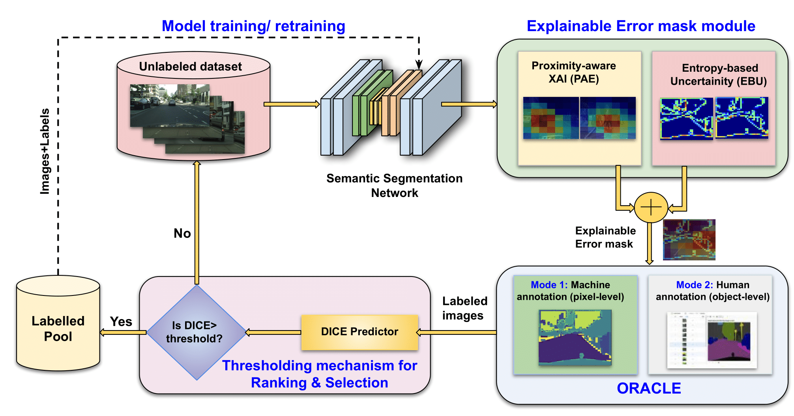

  

  <h1>SegXAL: Explainable Active Learning for Semantic Segmentation in Driving Scene Scenarios</h1> 

 

  

    <a href='https://srirammandalika.github.io/' target='_blank'>Sriram Mandalika</a>1&emsp;
    <a href='https://www.srmist.edu.in/faculty/dr-athira-m-nambiar/' target='_blank'>Athira Nambiar</a>1&emsp;
<!--     <a href='' target='_blank'>Enzo Tartaglione</a>1&emsp;
    <a href='' target='_blank'>Stéphane Lathuilière </a>1 -->

1SRM Institute of Science and Technology, Kattankulathur, India - 603203&emsp;

<!-- 2University of Trento, Italy&emsp; -->

 

The code repository for "[SegXAL: Explainable Active Learning for Semantic Segmentation in Driving Scene Scenarios](https://arxiv.org/abs/2408.04482)" in PyTorch.

## Abstract
Most of the sophisticated AI models utilize huge amounts
of annotated data and heavy training for high-end performance. However, for real-world deployment, there are some predominant informative factors such as domain knowledge, priors and human domain expertise, which are not yet effectively utilized in the existing AI models.
As a result, a semantic gap exists between humans and machines, that
hinders “in-the-wild” applications, in terms of efficient use of available
data, human expertise and interpretation of the results. To this end,
we propose a novel Explainable Active Learning (XAL) model that can
facilitate the “Human-in-the-loop” paradigm and augment the model
decisions in an interpretable way. In particular, we investigate the proposed XAL paradigm towards the semantic segmentation task in driving
scene scenarios, which is termed as ‘XAL-based semantic segmentation model “SegXAL” for the driving scene scenarios’. The SegXAL
model proposes the image regions that require labelling assistance from
Oracle by dint of explainable AI (XAI) and uncertainty measures in a
weakly-supervised manner. This learning will be further augmented into
the unlabelled data via an active learning strategy. Specifically, we leverage Grad-CAM-based XAI and Entropy-based uncertainty metrics to
enable the machine teachers” (human experts) to provide intuitive rea-
soning behind the results and to solicit feedback to the AI system. Such a
mechanism bridges the semantic gap between man and machine through
collaborative intelligence, where humans and AI actively enhance each
other’s complementary strengths. Extensive quantitative and qualitative analyses are carried out in the Cityscape dataset. Results show the
superior performance of our proposed XAL model compared with the
state-of-the-art models

## Our Network

# Software requirements:
- Numpy, scipy, pytorch, sklearn, matplotlib, pandas

- To download the dependencies: **!pip install -r requirements.txt**

- The code can be run on any PC.

# Dataset: 
- We use Cityscapes datasets: Initial run of 40% of the labelled pool.

The dataset can be found here: https://www.cityscapes-dataset.com/

## Class-wise IoU and mIoU on Cityscape dataset with 40% training data. 
For clarity, only the average of 5 runs are reported, and the best and the second-best results
are highlighted in **bold** and italics

| Method         | **Road** | **Sidewalk** | **Building** | **Wall** | **Fence** | **Pole** | **Traffic Light** | **Traffic Sign** | **Vegetation** | **Terrain** |
|----------------|----------|--------------|--------------|----------|-----------|----------|-------------------|------------------|----------------|-------------|
| Supervised     | **97.58** | 80.55       | 88.43       | 51.22    | 47.61     | 35.19    | **42.19**         | **56.79**        | **89.41**      | **60.22**   |
| Random [21]    | 96.03    | 72.36       | 86.79       | 43.56    | 44.22     | 36.99    | 35.28             | 53.87            | 86.91          | 54.58       |
| Entropy [21]   | 96.28    | **73.31**   | 87.13       | 43.51    | 45.32     | 38.10    | 37.74             | 55.39            | 87.52          | 53.68       |
| Core-Set [34]  | 96.12    | 72.76       | 87.03       | 44.86    | **45.86** | 31.84    | 34.81             | 53.07            | 87.18          | 53.49       |
| DEAL [2]       | 95.89    | 71.69       | 86.17       | 45.61    | 44.94     | **38.29**| 36.51             | 55.47            | 87.35          | 56.90       |
| **Ours (GT)**  | 96.67    | 72.42       | 87.04       | 46.35    | 45.02     | 36.26    | 36.51             | 55.78            | 87.93          | 57.86       |
| **Ours (Manual)**| 96.91  | 72.68       | **87.44**   | 46.62    | 45.22     | 35.62    | 36.24             | 55.78            | 87.66          | 57.86       |

| Method         | **Sky**  | **Pedestrian** | **Rider** | **Car**  | **Truck** | **Bus**  | **Train** | **Motor Cycle** | **Bicycle** | **mIoU** |
|----------------|----------|----------------|-----------|----------|-----------|----------|-----------|-----------------|-------------|-----------|
| Supervised     | **92.69**| **65.12**      | 37.32     | **90.67**| **66.24** | **71.84**| **63.84** | **42.35**       | **61.84**   | **65.30** |
| Random [21]    | 91.47    | 62.74          | 37.51     | 88.05    | 56.64     | 61.00    | 43.69     | 30.58           | 55.67       | 59.00     |
| Entropy [21]   | 92.05    | 63.96          | 34.44     | 88.38    | 59.38     | 64.64    | 50.80     | 36.13           | 57.10       | 61.46     |
| Core-Set [34]  | 91.89    | 62.48          | 36.23     | 87.63    | 57.25     | 67.02    | 56.59     | 29.34           | 56.59       | 60.69     |
| DEAL [2]       | 91.78    | 64.25          | **39.77** | 88.11    | 56.87     | 64.46    | 50.39     | **38.92**       | 56.59       | 60.69     |
| **Ours (GT)**  | 92.18    | 62.53          | 38.82     | 88.61    | 59.07     | 65.72    | 47.12     | 35.41           | 55.83       | 63.56     |
| **Ours (Manual)**| **92.84**| 62.73       | 39.34     | 87.97    | 59.43     | 65.70    | 46.88     | 35.53           | 54.93       | **64.37** |

# For further details, contact
athiram@srmist.edu.in, mc9991@srmist.edu.in
